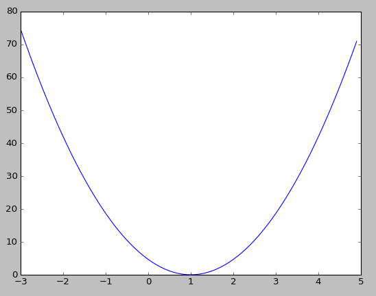

### Linear Regression의 cost 최소화 알고리즘의 원리

#### Cost 함수의 생김새
Data Set

    X = [1, 2, 3]
    Y = [1, 2, 3]

1을 기준으로 값이 점점 줄어드는 것을 볼 수 있다

#### Gradient descent algorithm
* 경사를 따라 내려가는 알고리즘
* Cost 최소화 알고리즘
* Cost가 최소화 되는 지점의 값을 찾아준다

#### 동작 방식
* 아무 지점에서 시작
* W와 b를 조금씩 바꾸면서 Cost를 낮춘다
* **극솟값(local minimum)** 이 될때까지 반복한다

#### Detail

$$ cost = \frac{1}{m} \sum_{m}^{i=1}(Wx^i - y^i)^2 $$

위 식과 같이 Cost를 계산하는 수식에서

$$ W := W - \alpha  \frac{\delta}{\delta W} cost(W) $$

위와 같이 W를 미분하고 Learning rate를 곱한 값을 빼면 된다 즉 **미분을 해서 구한 현재의 기울기** 에 작은 값(Learning rate)을 곱하고 빼면 되는 것이다.

$$ W := W - \alpha \frac{1}{m} \sum_{m}^{i=1}(Wx^i - y^i)x^i $$

결과적으로 위와 같은 식이 된다

#### Convex function

* 어느 점에서 시작하든 간에 도착하는 곳이 원하는 지점
* Gradient descent 알고리즘을 보장해준다
* Cost function을 설계할 때 모양이 Convex function이 되는지 확인이 필요하다
