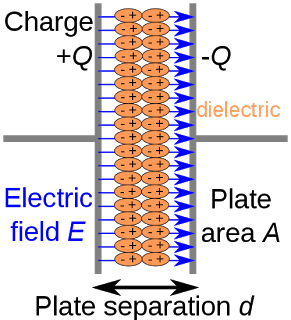

## Capacitor

#### Capacitor의 구조와 저장 원리

캐패시터의 양쪽 끝단에 도체와 그 사이에 절연체(부도체) 가 위치하게 되어

각 양쪽에 +전하와 -전하가 쿨롱의 법칙에 의해 서로 당기게 되어 저장 될 수 있다

유전체(dielectric) 부분을 보면 +Q쪽에는 -가 -Q쪽에는 +가 위치한 것을 볼 수 있다

이렇게 되면 극판 내부에 전기장이 형성된다

#### Capacitor에 대한 식

\[Q = CV\]

Q는 전하, C는 정전 용량, V는 전압

두 극판 사이의 거리가 일정할 때 V가 크면 클수록 더 많은 Q가 저장될 수 있습니다

#### Capacitor의 역할

회로에서 DC는 막고 AC를 통과 시키는 역할을 합니다

다시 말하면 DC에 대해서 저항이 크고 AC에 대해서는 저항이 적다고 말할 수도 있습니다

#### Capacitor가 DC를 막는 원리

Capacitor의 용량 Q = CV 만큼 충전하고 나면 더이상 양 단의 전위차가 없어지기 때문에 전류가 흐르지 않습니다

#### Capacitor가 AC를 통과시키는 원리

Capacitor를 연결하는 전원이 AC라면 극성이 수시로 바뀌게 됩니다

AC전압이 바뀔때 마다, 즉 극성이 바뀔 때 마다 방출과, 충전을 반복하며 전류가 흐르는 것처럼 보이게 됩니다

#### Reference
https://www.kocoafab.cc/tutorial/view/582
https://ghebook.blogspot.kr/2011/06/capacitor.html
http://blog.naver.com/knv790/220017330654
