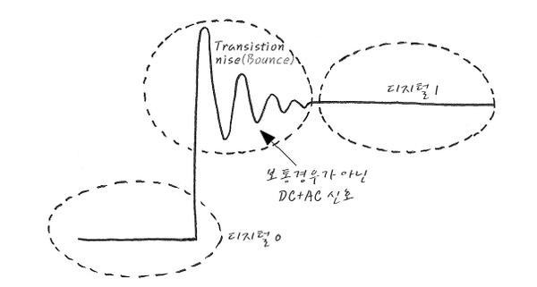

# Analog / Digital / Ground

### Digital / Analog

#### 1. Analog
* 어떤 자료를 '길이', '각도' 또는 '전류'와 같이 외부적인 원인에 의해 연속적으로 변하는 것들을 물리량으로 나타내는 일

#### 2. Digital
* Digital 신호는 Analog 신호의 일부 이다
* Digiatl 신호는 **대부분**DC 성분으로 이루어진 **Boolean Logic**값
* HIGH와 LOW 두가지 Logic Value를 가질 수 있다
* **임계값(Threshold)** 을 기준으로 HIGH와 LOW를 나눈다

### Bounce


Digital 신호는
``` 1->0 또는 0->1```
로 변할 때 위 사진처럼 Bounce라는 요동이 생깁니다

이런 의미에서 볼 때 Digital 신호는 **DC성분 뿐만 아니라 AC성분도**포함하고 있다는 것을 알 수 있다

이런 Bounce가 일어날 때 회로의 전압, 전류 문제가 일어 날 수 있고
``` 0을 1로 / 1을 0으로 ```
인식할 수 있다는 큰 문제가 생깁니다

### Ground
정의 : 모든 전기, 전자 회로에서 다른 **모든 전위에 대하여 기준**이 되는 **0V**

* System 내부에서 모든 Current가 몰려드는 곳
* Digital System에서 0과 1을 구분하기 위한 기준점

Ground는 **Earth**와 **Signal Ground**로 나뉘게 된다

#### Earth Ground
실제로 전위 0V를 의미하지는 않으나, 저항이 크기 않아 웬만한 전류는 빨아들인다.
그래서 커다란 어떤 전자기기는 직접 땅에 연결을 한다

#### Signal Ground
Hardeware측면에서 어떤 전자기기의 GND를 의미,
이 말은 System 내부의 모든 전위에 대하여 기준이 되는 점

보통은 전지의 -극을 저항이 적은 넓은 모양의 case나 PCB기판의 뒷면 등에 연결 하여 전류가 몰려들 수 있는 환경을 만든다

### Reference
 이 문서는 하단 주소를 기반으로 작성하였음을 알립니다

 <http://recipes.egloos.com/>
