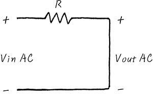

## 초간단 회로이론 응용 - 필터(Filter)

```필터 : 원하는 성분만 통과시키는 것```

### LPF ( Low Pass Filter)
* 저주파 성분만 통과시킨다 => 고주파 성분을 통과 시키지 않는다

보통 Embedded System은 작은 보드에다 이것 저것 밀집시키는 속성이 있기 때문에 **고주파의 Noise**는 골치 아픈 존재가 됩니다

그래서 **LPF** 고주파 성분은 걸러내는 것이 목적입니다


위 그림에서 볼 수 있듯이 입력 전원(Vin) 은 DC성분과 AC 성분으로 이루어져 있습니다

이 회로를 DC성분의 입장과 AC 성분의 입장으로 바라봅시다

#### DC성분 입장


DC입장에서 바라본 회로입니다

DC입장에서는 Capacitor을 보면 거의 통과하지 못하니까, 끊어진 회로와 다름이 없습니다

하지만 거의 **무한대**의 저항이 달려있다고 생각하면, 폐회로가 이루어 집니다. R과 무한대의 저항은 직렬로 연결되어 있으니까, 저항의 크기는 무한대의 저항과 다를게 없습니다.

그렇다고 치면, 전류는 **아주 조금** 흐르게 되고, 아주 조금 흐른다는 얘기는 R에서 **소모하는 전압은 거의 없습니다**

(저항은 클수록 전류를 적게 보내주고,   )

#### AC성분 입장

