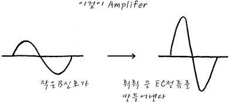

## Transistor 1%

### Transistor란

Transistor는 **Trans-Resistor** 이다. 즉 Resistor 값을 변화 시킬 수 있다는 의미가 된다

또 다시 말하면 **전류의 양을 조절 할 수 있다** 는 의미가 됩니다

### Switch 역할

B(베이스)는 C(콜렉터)와 E(이미터) 사이에 전류를 통과 시켜주는 **Switch** 역할을 합니다

B에 의해 Switch가 ON 되면 C와 E사이에 전류가 흐르게 되는거죠

### Amplifier(증폭) 역할

Resistor의 의미에서 바라보면, Switch를 더 세게 누르면 C와 E사이에 **전류가 더** 흐르게 됩니다. 그 반대로 Switch를 덜 세게 누르면 C와 E사이에 **전류가 더 작게** 흐르게 됩니다

B를 얼마나 세게 누르냐에 따라 C와 E에 통하는 전류가 변하게 되고, 즉 저항값이 바뀐다는 의미가 됩니다

* 활성 영역 : CE간에 전류가 B의 작은 입력 변화에 따라서 휙휙 바뀌는 영역
* 차단 영역 : B에 흐르는 전압(전류)가 너무 낮아서 CE사이에 전류가 못 흐르는 영역
* 포화 영역 : B에 흐르는 전압(전류)가 너무 높아서 CE사이에 전류가 더 이상 증가하지 않는 영역

#### Reference
이 문서는 하단 주소의 내용을 기반으로 작성하였음을 알립니다

<http://recipes.egloos.com/>
