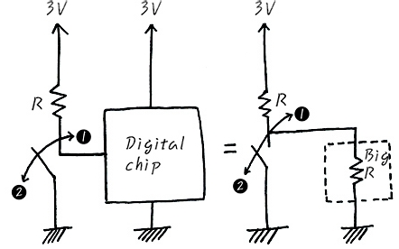
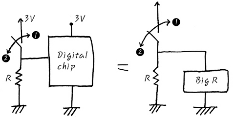

## Pull up, Pull Down 그리고 Open Collector

### Active 상태
* Low Active : LOW에서 동작한다
* High Active : HIGH에서 동작한다

Low Active 상태는 명확히 하기 위해서 /, N, -, * 등을 뒤에 붙여서 표기한다

### Pull up과 Pull Down

Pull up과 Pull Down이 있는 이유는 현실에서의 회로는 **이상적이지 않기** 때문입니다. 예를 들어 High Active인 Digital Chip의 경우에 외부요인(Ex : 정전기, 접촉)에 의해 순간적으로 그때의 input이 High가 될 수 있습니다.

결국 **확실한 Default** 값을 보장하기 위해서 사용합니다

#### Pull up

* 1번 스위치 On 상태에서는 Digital Chip의 Input에 0V가 가해집니다
* 2번 스위치 Off 상태에서는 Digital Chip의 Input에 3V가 가해집니다

즉 스위치가 On 될 때는 Low가 인가되고 Off상태에서는 HIGH가 인가됩니다.

#### Pull down

* 1번 스위치 On 상태에서는 Digital Chip의 Input에 3V가 가해집니다
* 2번 스위치 Off 상태에서는 Digital Chip의 Input에 0V가 가해집니다

즉 스위치가 On 될 때는 HIGH가 인가되고 Off상태에서는 Low가 인가됩니다.
