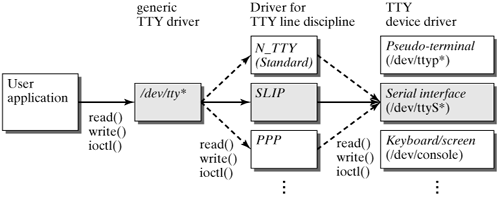

## Line discipline

### 정의
Line discipline이란 유닉스 계열의 시스템에서 terminal subsystem의 한 레이어다.

**terminal subsystem** 은 3가지의 레이어로 구성되어 있다

* Upper layer : character device의 interface를 제공하는 층
* Line discipline : 드라이버 정책에 대한 명세를하는 층
* Hardware drive : 하드웨어나 pseudo terminal과 통신하기 위한 층

아래서부터 위로 갈수록 높은층이다

### 특징
Line discipline은 low level의 device driver코드와 high level의 일반적인 interface routine(read(), write(), ioctl() 처럼)을 접착제처럼 붙여줍니다.
그리고 장치에 관련된 의미 체계를 구현해야 합니다(?).

정책은 device driver과 분리되어 있기 때문에 다른 데이터 핸들링이 요구되는 device에서 같은  serial hardware driver에 의해 사용될 수 있습니다.

>위에 나온 사진이 잘 표현해주고 있다. 하나의  serial hardware driver에서 3개의 line discipline의 정책이 포함된 것을 볼수 있다. 좀 더 풀어서 말하면 device에서 처리 해야하는 데이터가 여러개 일때 serial hardware driver를 여러개 사용하지 않고 line discipline에서 여러개의 정책을 가지면 된다는 것이다.

### 예시
예를들어, line discipline은 유닉스 계열의 시스템의 터미널 요구사항에 따라 하드웨어 드라이버에서 받거나 application에서 디바이스로 쓰는 데이터를 처리합니다.
입력에는 Control-C, Backsapce, Delete같은 special key를 다루고, 출력에는 LF문자를 CR/LF로 처리합니다.
> 위 예시에서 출력쪽이 이해가 안가시면 윈도우와 리눅스의 줄바꿈 차이를 찾아보시면 됩니다.

### 한줄 요약
정말 간단하게 말하자면 application과 device driver사이에서 정의된 정책에 의해 데이터 처리를 하는 놈이라고 생각하면 된다.

### 출처
https://en.wikipedia.org/wiki/Line_discipline
http://flylib.com/books/en/3.475.1.43/1/
