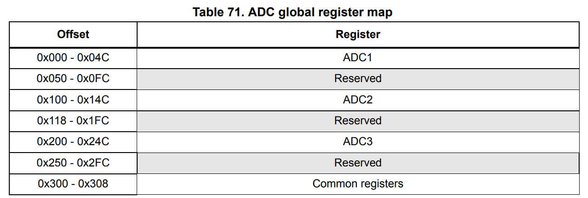

# ADC

### ADC introduction
12-bit의 ADC는 연속적으로 근사치를 구하는 analog-to-digital converter이다. 이것은 16개의 외부 source, 2개의 내부 source, 그리고 Vbat channel로부터 신호 측정을 가능하게 하는 19개의 multiplexed channel이 있다. channel들의 A/D 변환은 single, continuous, scan 혹은 discontinuous mode로 수행될 수 있다. ADC의 결과는 left-aligned 혹은 right-aligned된 16bit data regitser에 저장된다.

### ADC main features
* 12-bit, 10-bit, 8-bit, 6-bit의 설정 가능한 분해능
* end of conversion, end of injected conversion, analog watchdog, overrun event 들이 일어날때 interrupt 발생
* Single 그리고 continuous 변환 모드
* channel 0부터 channel 'n'까지 자동 conversion을 위한 scan mode
* Data alignment와 내장된 data 일관성 (?)
* Channel별로 programmable한 sampling time
* regular와 injected 변환 둘개를 위한 External trigger의 configurable한 polarity 옵션
* Discontinuous mode
* Dual/Triple mode (장치에 ADC가 2개 혹은 그 이상 있을 때)
* Dual/Triple mode에서 설정가능한 DMA data storage
* ADC 변환 type
* ADC 공급에 필요한것 : 2.4V에서 3.6V까지 full speed 그리고 1.8V에서 slower speed
* ADC 입력 범위 : Vref- <= Vin <= Vref+
* 일반 channel conversion에 DMA request generation

### ADC clock

ADC는 두가지 클럭을 방식을 특징으로 가진다 :
* 아날로그 회로를 위한 clock: ADCCLK, 모든 ADC에 공통. 이 클럭은 2, 4, 6, 8 으로 프로그래밍 하여 분주할 수 있는 prescaler에 의해 APB2 클럭에서 나뉘어져 생성된다.

* Digital interface를 위한 Clock(regitser에 읽기/쓰기 접근을 하기 위해 사용됨). 이 클럭은 APB2 클럭과 똑같다. 이 digital interface 클럭은 RCC_APB2ENR regitser를 통해 ADC각각 enable/disable 될 수 있다.

### Channel selection
16개의 multiplexed된 channel이 있다. 변환하는 것을 두 개의 그룹으로 조직할 수 있다: regular과 injected. 그룹은 어떤 channel이건, 어떤 순서던지 완료될 수 있는 변환의 일련으로 이루어져 있다. 예를들어, 다음과 같은 일련의 변환을 실행할 수 있다:ADC_IN3, ADC_IN8, ADC_IN2 ....

* **regular group** 은 16개의 변환으로 이루어져 있다. 일련의 변환 순서와 regular channel은 **ADC_SQRx** regitser에 선택되어야 한다. **regular group** 에서의 총 변환 수는 반드시 **ADC_SQR1** regitser의 **L[3:0]** bit에 써줘야 한다.

* **injected group** 은 4개의 변환으로 이루어져 있다. 일련의 변환 순서와 injected channel은 **ADC_JSQR** regitser에 선택되어야 한다. **injected group** 에서의 총 변환 수는 반드시 **ADC_JSQR** regitser의 **L[1:0]** bit에 써줘야 한다.

만약에 **ADC_SQRx** 또는 **ADC_JSQR** regitser들이 변환 도중에 변경되었다면, 새롭게 선택된 그룹으로 바꾸기 위해 현재 변환은 reset되고, start pulse를 ADC에 보낸다.

온도 센서, Vrefint 그리고 Vbat 내부 channel들
* **STM32F40x** 그리고 **STM32F41x** 장치들은, 온도 센서가 내부 channel ADC1_IN16에 연결되어 있다.
* 내부 reference voltage VREFINT는 ADC1_IN17에 연결되어 있다.
*

### Coding

ADC는 **APB2** 버스에 연결되어 있으므로 **APB2ENR** regitser에 **ADCxEN** bit를 set해주면 된다.

ADC의 Power을 ON 시키기 위해, **ADC_CR2** 의 0번 bit인 **ADON** bit를 set해주어야 한다.

**ADC_SQR1** 의 **L** bit는 ADC 순차 변환 갯수를 정하는 regitser이다. **SQx** bit는 정규채널 (0...18)의 변환 순서를 정한다. 만약에 CHANNEL4번의 변환 순차를 가장 먼저 하고 싶다면 **SQ1** bit에 4를 써 넣으면 된다.

ADC는 3가지의 Channel로 이루어져 있다. ADCx_IN(0~15)가 GPIO핀에 고정되어 있다.
