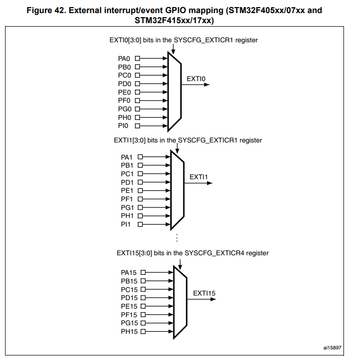
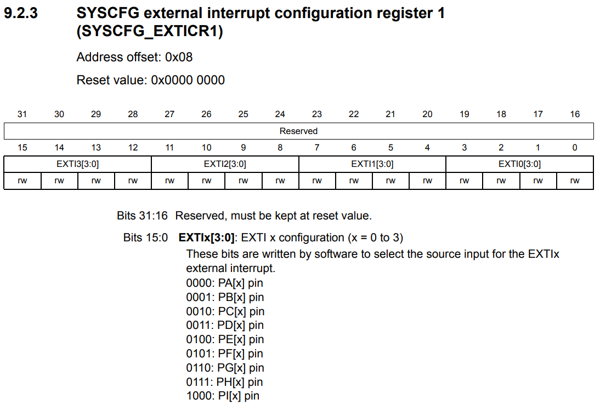
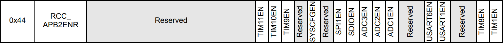
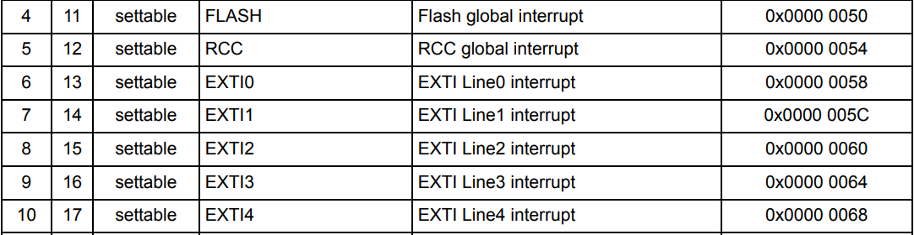
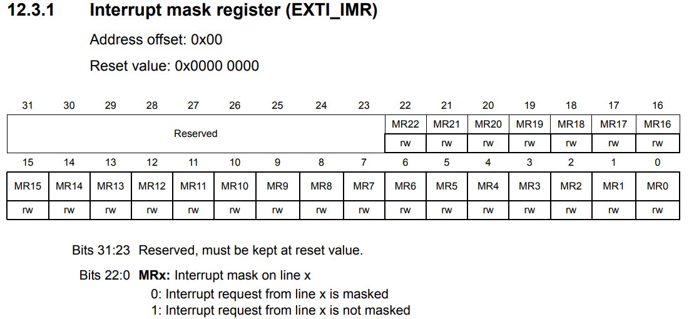
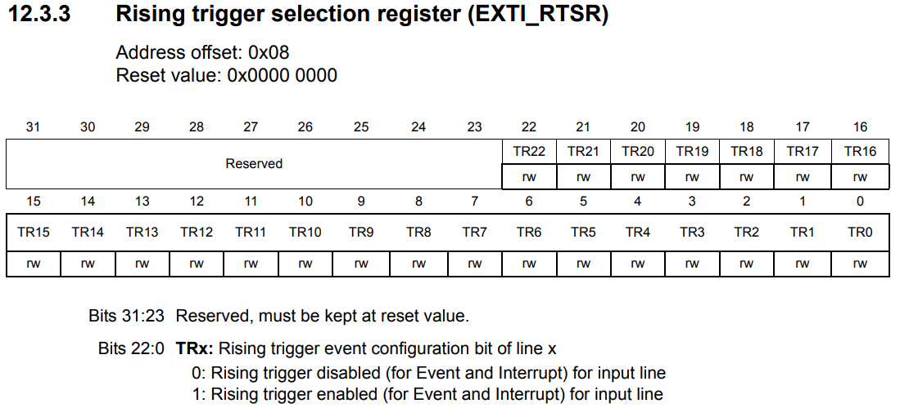
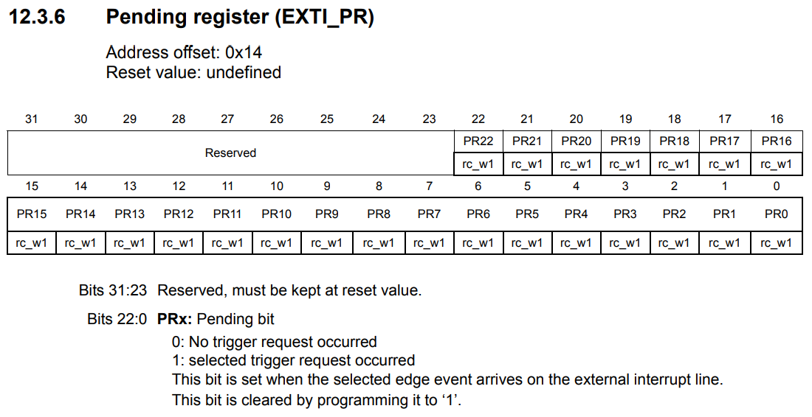
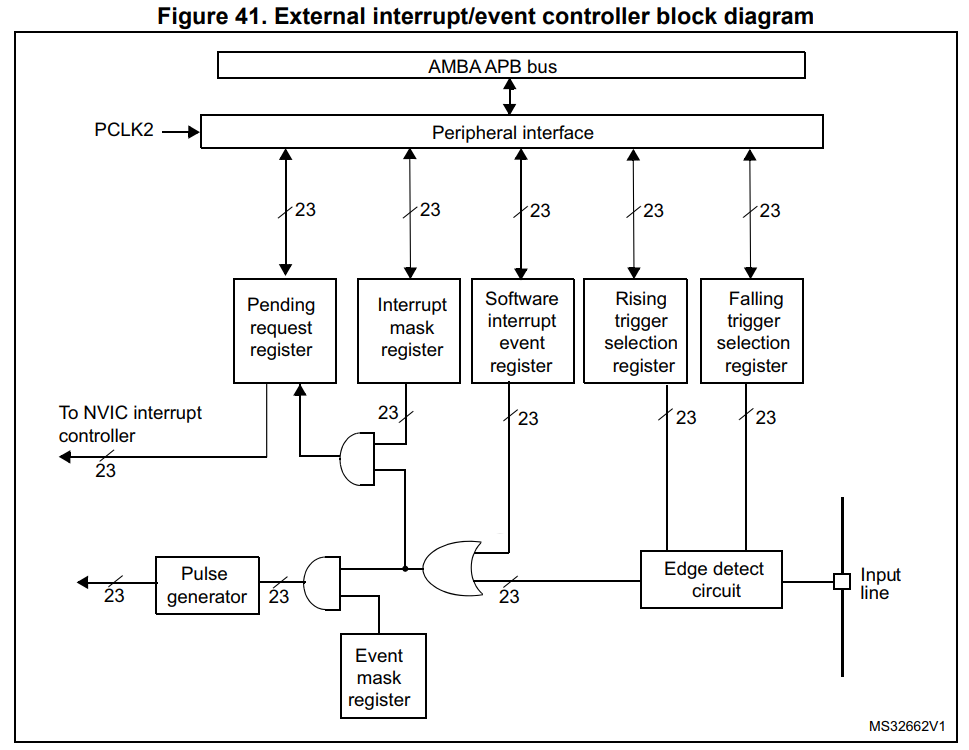

# EXTI

## Coding
레지스터 세팅을 통해 외부 인터럽트를 사용하기 위한 글이다.

**External interrupt GPIO mapping** 을 살펴보면 모든 포트의 같은 숫자들끼리 MUX를 통해 하나가 선택되어 EXTI 핀이 된다.

많은 포트들 중에서 PB2번을 사용하기 위해 **SYSCFG_EXTICRx** 레지스터에 세팅을 해줘야 한다. PB2번 포트이므로 **EXTI2** 를 선택하고, **B** 포트의 숫자인 **0001** 으로 설정하면 된다.

위에서 말한 SYSCFG를 사용하기 위해 **RCC_APB2ENR** 레지스터에 14번 bit인 **SYSCFGEN** 레지스터를 SET 해준다.

**Vector table** 에 사용하고자하는 EXTI2의 정보가 있다.

**Interrupt Mask Register** 이다. 기본 Reset 상태의 값은 0, 즉 mask된 상태이기 때문에 set하여 mask를 없애줘야 한다. 사용하고자 하는 EXTI는 2번이므로 **MR2** 의 비트를 set해준다.

**Rising trigger selection register** 이다. 사용하는 EXTI핀에 Rising Edge가 감지되었다면 Pending 레지스터에 set하게 된다. **Falling edge** 도 마찬가지다. Falling edge가 감지되었다면 Pending 레지스터에 set하게 된다.

**Pending Register** 이다. 만약 Interrupt가 발생하면 해당하는 bit가 set된다. NVIC은 **Pending Register** 를 보고 IRQ에 들어가는데 자동으로 reset을 해주지 않으므로 사용자가 IRQ내부에서 해당 비트를 set함으로서 reset 시켜줘야 한다. 만약 해당 비트가 reset되지 않았다면, NVIC은 계속 IRQ에 접근할 것이다.

위의 내용을 Block diagram으로 정리한 사진이다. **Input line** 에서 입력이 들어오면 **Edge detect circuit** 을 통해  Rising인지 Falling인지 판단하게 된다. 그 후 **Software interrupt event register**
와 OR연산을 하게 된다. 그 다음은 **Interrupt mask register** 과 AND연산을 통해 실제로 **Pending request register** 에 쓰게 된다. 
