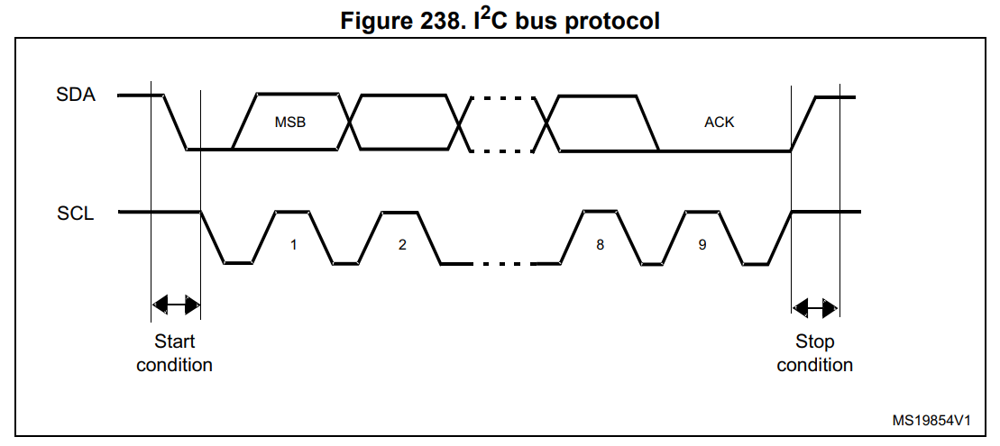
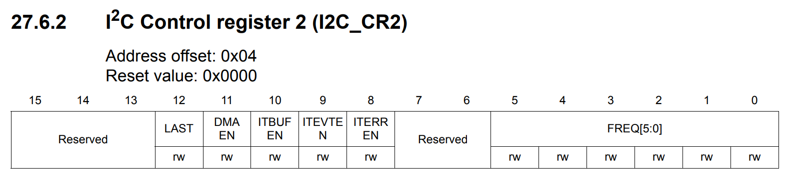
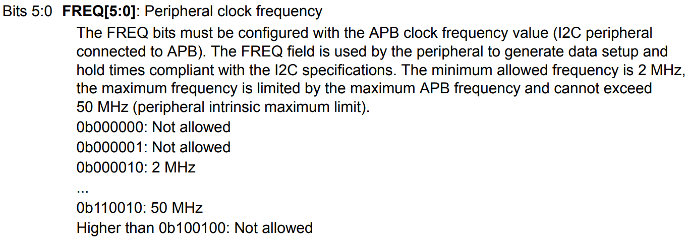
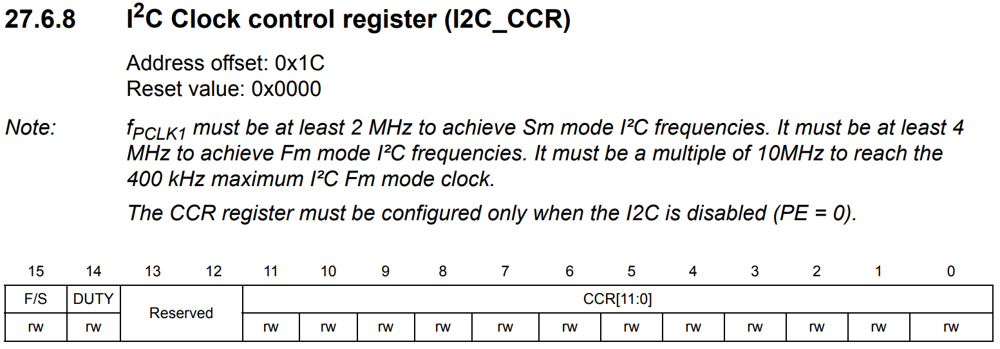
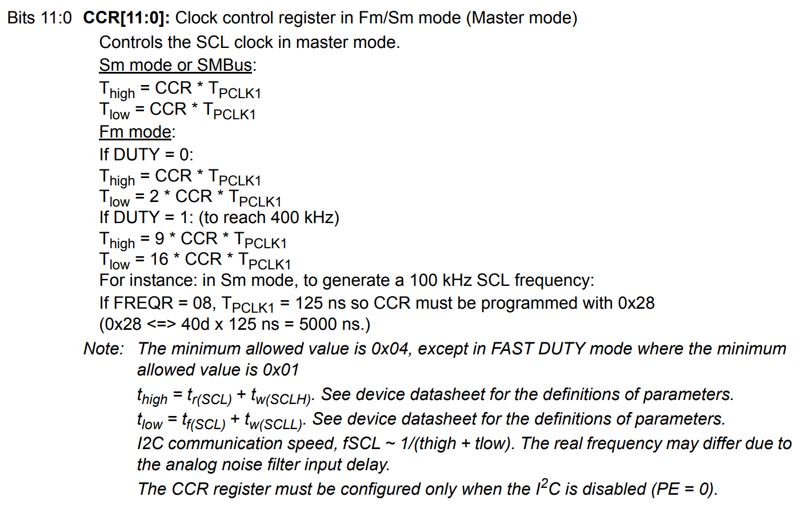

# I2C

### I2C introduction
I2C bus interface는 microcontroller와 serial I2C bus 사이에서 interface로서 제공한다. 이것은 multimaster 기능, 그리고 I2C bus-specific sequencing, protocol, 중재 그리고 timing을 control한다. 이것은 standard mode(Sm, 100kHz까지) 그리고 Fm mode(Fm, 400kHz까지)를 지원한다.

이것은 CRC 생성 및 확인, SMBus(system management bus) 그리고 PMBus (power management bus)를 포함한 다양한 목적들에 사용된다.

### I2C main features
* 병렬 버스/I2C protocol conveter
* Multimaster 기능: 똑같은 interface가 Master혹은 Slave로 동작 가능
* I2C Master 기능: 클럭 생성, Start와 Stop 생성
* I2C Slave 기능: Programmable한 I2C 주소 감지, 2개의 slave address로 Dual adderessing 기능, Stop bit 감지
* 7-bit/10-bit adderssing 그리고 General Call 생성 혹은 감지
* 다른 통신 속도 지원: Standard speed(100kHz), Fast speed(400kHz)
* Analog 노이즈 필터
* 상태 flags : Transmitter/Receiver mode flag, End-of-Byte 전달 flag, I2C busy flag
* 에러 flags : master mode에서 중재기 lost 상태, address/data 전달 후에 acknowledgment 실패, 잘못 배치된 start 혹은 stop 상태 감지, 만약 clock stretching이 disable이라면 Overrun/Underrun
* 두개의 interrupt vector: address/data 통신 성공, 에러 컨디션
* 선택할수 있는 clock stretching
* DMA 기능과 1-byte buffer

### Mode Selection
interface는 다음 4가지 모드로 동작할 수 있다:
* Slave 송신
* Slave 수신
* Master 송신
* Master 수신

기본적으로, Slave 모드로 동작한다. interface는 **START** condition을 생성했을 때 자동적으로 slave에서 master로 바뀐다. 만약에 중재(arbitration)이 loss 됬거나, Stop generation이 일어났을 때 master에서 slave로 바뀐다.

### Communication flow
Master 모드에서, I2C interface는 data를 전송하고 clock signal을 생성한다. 전송되는 serial data는 항상 start condition 에서 시작하여 stop condition에서 끝난다.  start/stop condition 둘다 master 모드에서 software에 의해 생성된다.

Slave 모드에서, interface는 (7 or 10-bit)인 자기 자신의 주소와 General Call 주소를 알 수 있다. General Call address 감지는 software에 의해 enable/disable 된다.

Data와 address는 MSB를 우선으로 8-bit bytes를 전송된다. start condition을 포함하고 있는 첫번째 byte는 주소를 포함하고 있다. 주소는 항상 Master mode에서 전송되어진다.    

8번째 byte 전송 후에 따라오는 9번째 clock pulse동안 receiver는 반드시 acknowledge bit를 transmitter에 보내야 한다.

Acknowledge는 software에 의해 enable/disable 될 수 있다. I2C interface 주소(7/10-bit, General call)은 software에 의해 선택될 수 있다.

### I2C Master mode

마스터 모드에서는, I2C interface가 data 전송을 하게하고, clock signal을 생성한다. serial data 전송은 항상 Start condition으로 시작하여 Stop condition으로 끝난다. Start condition이 버스에서 START 비트와 함께 생성되는 즉시 마스터 모드가 선택됩니다.

다음 일련의 순서가 master 모드에 필요하다.
* 정확한 timing을 위하여 **I2C_CR2** Register에 peripheral input clock을 program 한다
* clock control regitser을 설정한다
* rise time regitser을 설정한다
* peripheral를 enable하기 위해 **I2C_CR1** regitser을 program한다
* Start condition을 생성하기 위해 **I2C_CR1** regitser에 START bit를 set한다.

peripheral input clock frequency는 최소한은 다음과 같다 :
* Sm mode에서 2MHz
* Fm mode에서 4MHz

#### SCL master clock generation
CCR bit는 (개별적으로) rising/falling edge로 부터 시작하고, high/low level의 SCL clock을 생성한다.
슬레이브가 SCL 라인을 늘릴 수 있으므로, 주변 장치는 상승 에지 생성 후 TRISE 비트에 프로그래밍 된 시간이 끝날 때 버스에서 SCL 입력을 확인합니다.

### Slave address transmission

7-bit addressing mode에서는, 하나의 address byte가 보내진다. 주소가 보내지자 마자 hardware에 의해 **ADDR** bit가 set되고 만약 **ITEVFEN** bit가 set되어 있다면 interrupt가 생성된다. master는 slave address의 LSB를 보고 transmitter/receiver 무엇으로 작동할지 결정한다. 7-bit addressing mode 에서는 LSB가 0이면 transmitter, 1이면 receiver 으로 작동한다.

### Master transmitter

**ADDR** bit는 **SR1** regitser를 읽고 잇달아 **SR2** regitser을 읽음으로서 clear 할 수 있다.

### Coding

**I2C_CR2** regitser의 **FREQ** bit는

반드시 APB clock frequency로 설정되어야 한다. 이 FREQ 필드는 peripheral에 의해 I2C 스펙을 준수하여 data를 생성하거나 시간을 hold하는데 사용된다. APB bus는 42Mhz로 설정되어 있으니, 42로 설정하면 된다.

**I2C_CCR** register의 **CCR** bit는 SCL을 control한다.

CCR값을 구하기 위해서 여러 절차가 필요하다.

Thigh = CCR * Tpclk1

=> CCR = Thigh / Tpclk1

#### Tpclk1 구하기

PCLK는 peripheral clock speed 이다. 즉 APB bus의 속도 42Mhz가 된다.

t = 1/f 이므로

Tpclk1 = 1/42000000

Tpclk1 = 0.0000000238...

Tpclk1 = 23.8[ns] 가 된다

#### Thigh 구하기
Tscl = Thigh + Tlow

Thigh = Tlow

Thigh = Tscl / 2

Tscl = 1/Fscl

Fscl = 100000

Tscl = 1/100000

Tscl = 0.00001

Tscl = 10000[ns]

Thigh = 10000 / 2

Thigh = 5000[ns]

CCR = Thigh / Tpclk1

CCR = 5000 / 23.8

CCR = 23.8
