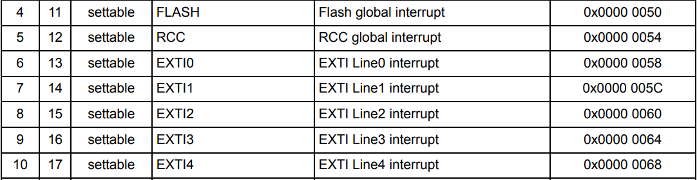
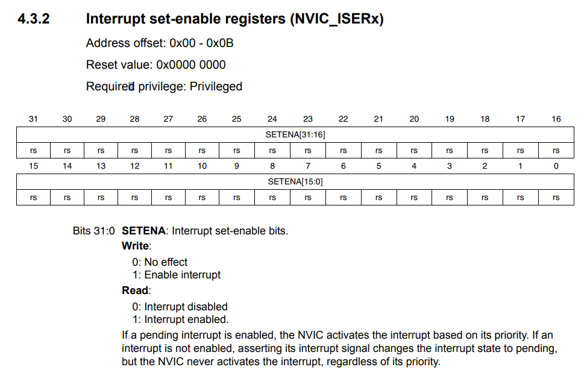

# NVIC

NVIC Register에 관련된 Datasheet는 **PM0214** 를 참조 하면 된다.

### NVIC features
Nested vector intterupt controller(NVIC) 은 다음과 같은 기능이 있다:
* 82개의 **maskable** 한 intterupt channels (FPU가 있는 Cortex-M4의 16개의 interrupt lines은 미포함)
* 16개의 programmable 한 **priority levels**
* **low-latency** exception과 interrupt handling
* power management 컨트롤
* system control register의 실행(?)

NVIC과 processor core는 가까이 붙어 있으므로, **low latency intterupt processing** 과 늦게 도착하는 interrupt들의 효과적인 processing이 가능해진다.

core exception을 포함한 모든 interrupt는 NVIC이 관리한다.

### Coding

**Vector table** 이다. 이 table은 NVIC Register를 setting할 때 참조하면 된다. Interrupt의 번호, priority, 이름, 설명, 주소를 알 수 있다.  

**Interrupt set-enable registers** 이다. **Interrupt vector table** 을 참조해서 원하는 bit에 set하면 해당 interrupt가 enable되어 사용할 수 있게 된다.
