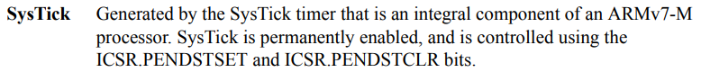
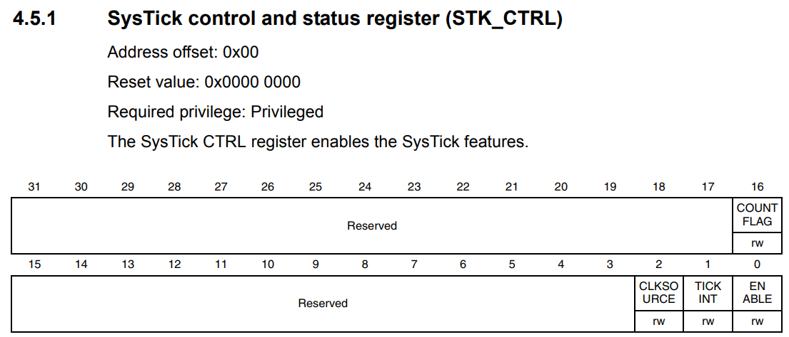
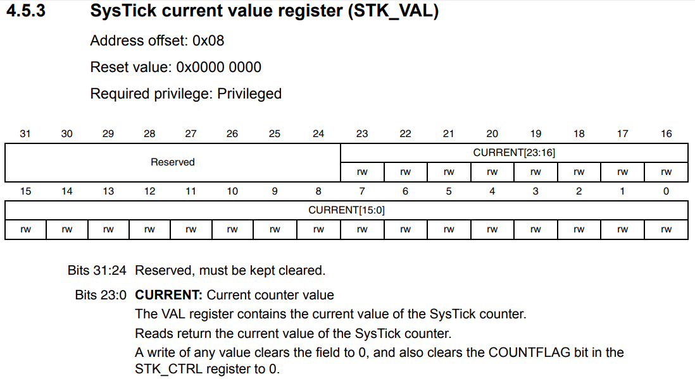
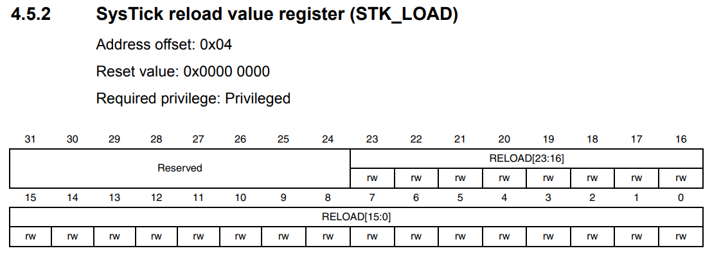
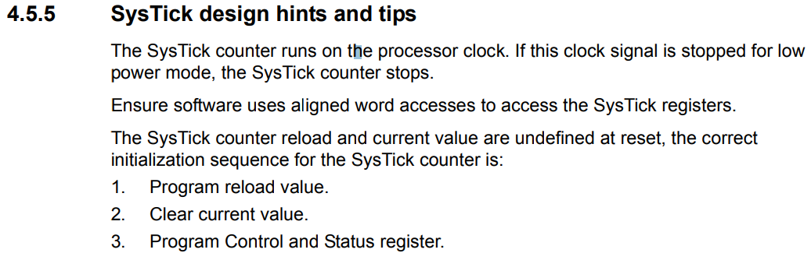

# Systick

### Basic

Systick은 ARM Core 내부에 있는 존재이다. 24-bit system timer이며, reload value에서 시작해 zero까지 내려간다. Clock은 AHB bus의 clock을 사용한다. **STK_CTRL** register의 **CLKSOURCE** 를 set하면 clock을 그대로 사용하고 clear를 하면 8로 분주하여 사용한다.

### Coding

위의 사진의 설명처럼 SysTick은 영구적으로 enabled 상태이다. 그리고 **ICSR.PENDSTSET** 와 **ICSR.PENDSTCLR** bit 에 의해 control 된다.

**STK_CTRL** register의 0번 bit **ENABLE** 가 카운터를 실제로 동작하게 만든다. 1번 bit **TICKINT** 는 update가 발생될 때 interrupt가 발생하도록 한다.

**STK_VAL** register는 현재 counter value를 저장하는 곳이다.

**STK_LOAD** register는 reload value가 저장되는 곳이다. 0까지 내려가 interrupt가 발생했다면, 다시 **STK_VAL** register는 **STK_LOAD** register의 값이 된다.

reset당시에 Systick counter의 reload 와 current value는 정의되지 않았으므로 정확한 initializaion이 필요하다
* reload value를 program
* current value를 clear
* control register와 status register를 program
