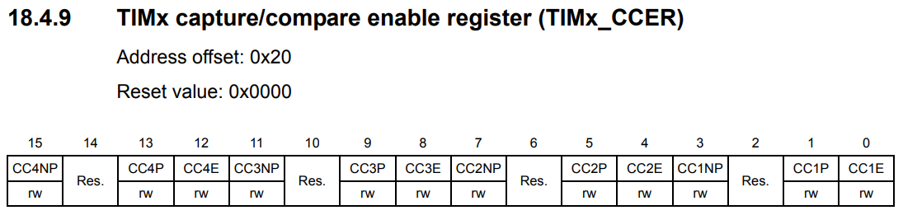

# INPUT Capture

### INPUT Capture
Input capture mode에서, **Capture/Compare** Register는 해당하는 ICx 신호에 의해 감지된 전이 후에 counter의 값을 latch하기 위해 사용된다. Capture이 일어날 때, 해당하는 **CCxIF** flag가 set되고 그리고 만약 interrupt나 DMA가 enable됬다면 request가 보내진다. 만약 **CCxIF** flag가 이미 HIGHT일 때 capture가 일어난다면, over-capture flag **CCxOF** 가 set된다. **CCxIF** 는 software에 의해 0을 씀으로서 혹은 **TIMx_CCRx** regitser에 저장된 captured data를 읽음으로서 clear된다. **CCxOF** 는 0으로 쓰여질때 clear된다.

TI1의 input이 rise가 됬을 때 **TIMx_CCR1** 의 counter value를 capture하는 방법이다 :
* 활성화된 input을 선택한다: **TIMx_CCR1** 은 **TI1** input과 반드시 연결되어야 한다, 그러므로  **TIMx_CCMR1** regitser의 **CC1S** bit에 01을 써주자. **CC1S** 가 00이 아니게 되자마자, channel은 input으로 설정되고 TIMx_CCR1 regitser는 read-only가 된다
* Timer에 연결된 신호에 대하여 input filter duration을 program 해야한다. 상상해보자, toggling 할 때, input 신호는 많으면 5개의 internal clock cycles 동안 안정적이지 않다.
*

### Coding

**Gnenral-purpose timer block diagram** 의 일부 모습이다. 좌측 부분에 **INPUT Capture** 의 block을 볼 수 있다. GPIO의 Alternate function에 의해 외부 PIN이 **TIMx_CHx** 에 연결된다. PIN에 신호가 오면 **TIMx_CHx** 에 전달되고, 전달된 신호가 TIx로 그리고 가공을 거쳐서 **ICx** 신호가 되어 현재 CNT value를 **Capture/Compare x regitser** 에 저장하는 것이다.

PORTB의 0번과 1번을 Input Capture의 입력 신호로 사용하기 위해 AF2의 **TIM3_CH3** 와 **TIM3_CH4** 를 사용한다.

**TIMx_CCMRx** regitser이다. 이 regitser는 **CCxS** bit의 설정에 따라 사용법이 다르다. Output compare mode와 Input capture mode로 나뉘는데 **CCxS** regitser를 **00** 으로 설정하면 Output compare mode가 되어 위 표의 위쪽 부분을 사용하게 되고, **00 이 아닌 그 외** 로 설정하면 Input capture mode가 되어 위 표의 아래쪽 부분을 사용하게 된다.

**CC3S** bit 이다. mode 설정과, Input capture mode일 경우에, **ICx** 와 **TIx** 를 어떻게 연결할지 정할 수도 있다.

**TIMx_CCER** regitser이다. Input capture을 enable하기 위해 **CCxE** bit를 설정하면 된다. 이 regitser는 위의 **TIMx_CCMRx** regitser의 **CCxS** bit를 설정한 것에 따라 설정이 바뀐다.
