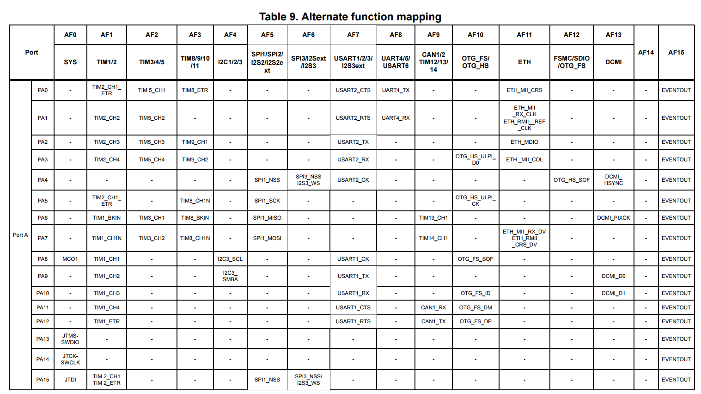
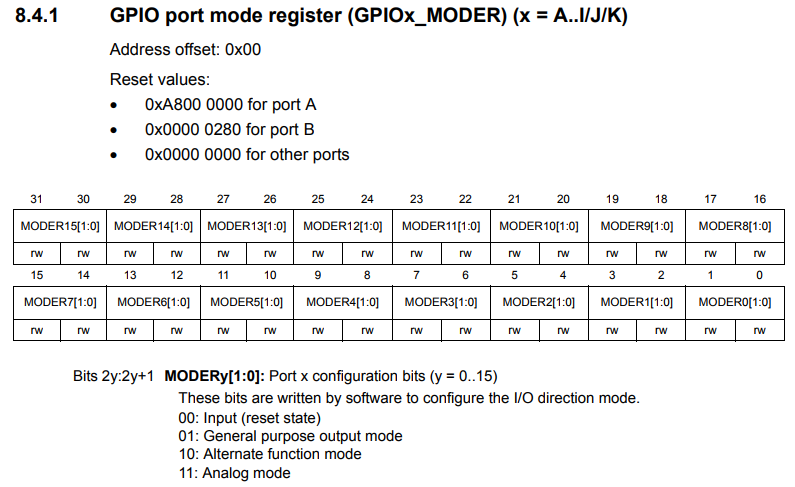
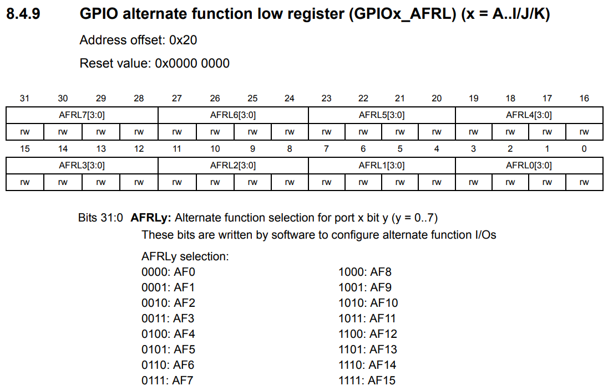
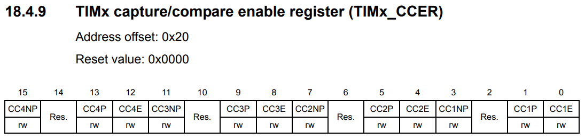
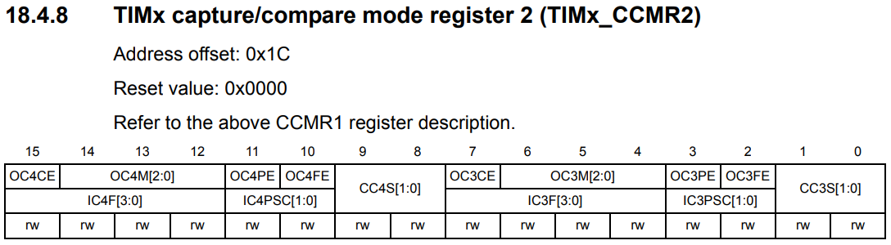
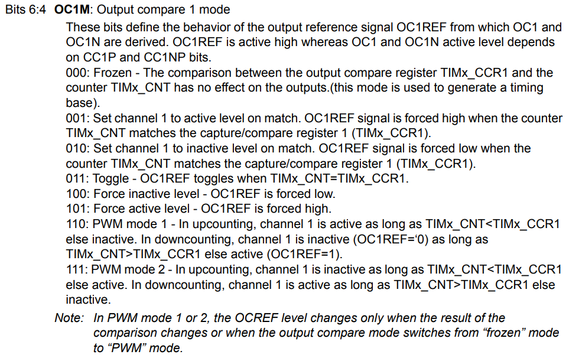
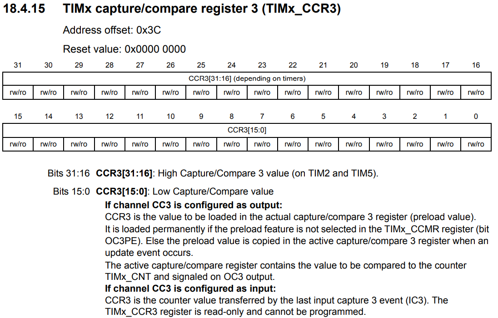

### Output comapre mode
이 기능은 output waveform을 control하거나 일정 기간 동안 지났음을 나타내기 위해 사용된다.

**capture/compare** register와 counter간의 match 상태일 때, output compare function :
* output compare mode(TIMx_CCMRx register 안의 OCxM bit) 그리고 output polarity(TIMx_CCER register 안의 CCxP bit)에 정의되어 있는 programmable한 값으로 해당 output pin을 지정할수 있다. output pin은 자신의 level을 유지하거나 (OCXM=000), set active(OCxM=001), set inactive(OCxM=010), toggle(OCxM=011) on match.
* **TIMx_SR** register의 **CCxIF** bit가 set됨 (capture compare x interrupt flag)
* 해당 interrupt mask가 set되어 있으면 interrupt 를 발생시킨다. (**TIMx_DIER** register의 **CCXIE** bit)
* 해당 enable bit가 set되어 있으면 DMA 요청을 보낸다. (**TIMx_DIER** register의 **CCxDE** bit, **TIMx_CR2** register의 **CCDS** bit)

Procedure :
* Counter의 clock을 선택한다
* TIMx_ARR 그리고 TIMx_CCRx 에 원했던 데이터를 쓴다
* 만약 interrupt 그리고/혹은 DMA request가 생성되기 위해서 **CCxIE** 그리고/혹은 **CCxDE** bit를 Set 해준다
* Output mode를 선택한다. 예를들어, CNT match 상태일 때 OCx output을 toggle 시키기 위해 **OCxM=0x11, OCxPE=0, CCxP=0, CCxE=1** 을 써줘야 한다.
* Counter를 동작시키기 위해 **TIMx_CR1** register의 **CEN** bit를 set해준다.

### PWM mode
**Pulse width modulation mode**는 **TIMx_ARR** register의 값에 의해 결정되는 frequency와 **TIMx_CCRx** register의 값에 의해 결정되는 duty cycle 가 있는 signal을 생성한다.

**PWM** mode는 **TIMx_CCMRx** register의 **OCxM** bit에 110(PWM mode 1) 혹은 111(PWM mode 2)를 쓰므로서, 각각의 채널(하나의 PWM 당 OCx output)에 독립적으로 선택될 수 있다. 사용자는 해당하는 preload register를 **TIMx_CCMRx** register의 **OCxPE** bit,

**OCx** polarity는 **TIMx_CCER** register의 **CCxP** bit를 사용해서 programming이 가능하다. 이것은 **Active high** 또는 **Active low** 로 program 될 수 있다. **OCx** output은 **TIMx_CCER** register의 **CCxE** bit로 enable된다.

### Coding
PA2, PA3번 포트를 PWM으로 제어 해본다.

Alternate function mapping을 보면 TIM2_CH3이 PA2에 TIM2_CH4 PA3에 연결되어 있다. GPIOA의 2, 3번 포트를 AF1로 사용하기 위한 설정이 필요하다

**GPIOA_MODER** register에 2번 3번을 Alternate function으로 사용하게 설정한다

**GPIOA_AFRL** register에 2번과 3번을 **AF1** 으로 사용하게 설정한다

**OCx** pin에서 신호 출력을 enable 하도록, **TIMx_CCER** register의 **CCxE** bit를 set해주면 된다. 3번과 4번을 사용할 것이므로 **CC3E와 CC4E** 를 set 한다.

**PWM Mode** 로 동작하기 위해 **OCxM** register에 설정을 해줘야 한다

**OCxM** register에 대한 설명이다. **PWM mode 1** 을 사용하기 위해 **OC3M** 그리고 **OC4M** bit 에 **110** 으로 설정한다

**TIMx_CNT** register 와 비교하면서 **OCx** 핀의 출력을 결정하는 register이다
