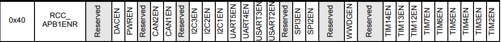
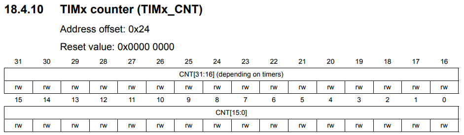
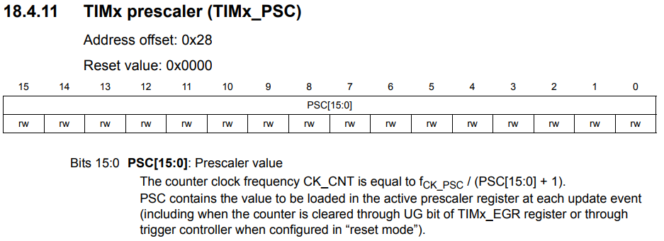
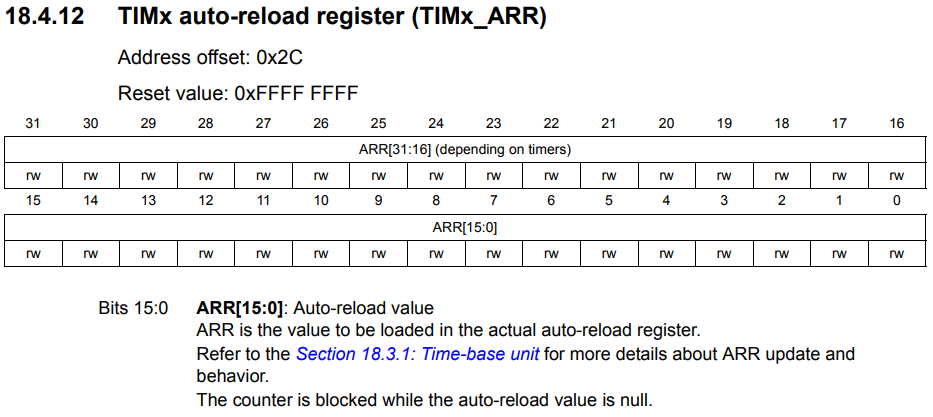
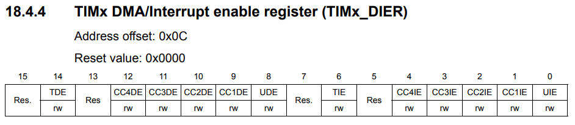
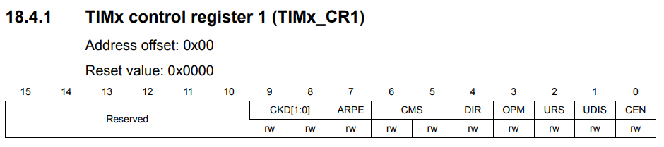
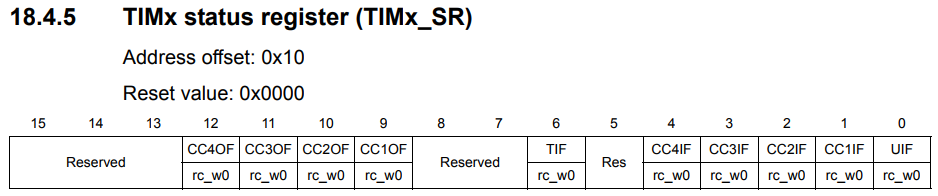

# TIMER
**STM32F4xx family를 기준으로 한다**

**TIMER 2 - 5 를 기준으로 설명**

### TIM2 to TIM5 introduction
16bit혹은 32bit의 auto-reload counter로 이루어져 있는 general-purpose timer들은 programmable한 prescale로 구동된다.

### Coding
TIMER3을 기준으로 **Update interrupt** 를 사용하는 방법에 대해 설명을 한다.

우선 TIMER3번을 사용하기 위해 **RCC_APB1ENR** 레지스터의 2번 비트 **TIMER3EN** bit를 set해준다.

TIMER의 기본이 되는 **TIMx_CNT** 레지스터이다. 이 레지스터가 실제로 시간을 세는 역할을 하게 된다. 상위 16bit는 32bit timer에서만 작동하고 하위 16bit는 모든 타이머에서 사용하게 되는데, 현재 사용하고자 하는 **TIMER3** 는 **16bit TIMER** 로 상위 32bit는 사용하지 않는다.  

**TIMx_PSC** register는 TIMER에 들어오는 clock을 쪼개주는 역할을 한다. 만약 prescale값이 **50** 으로 설정이 되어있다면, TIMER에 공급되는 클럭 50번당 **TIMERx_CNT** 레지스터의 값을 1 증가시키겠다는 의미이다.

**TIMx_ARR** 레지스터는 **update event** 를 발생시킬 시점을 결정한다. **TIMx_CNT** register가 **TIMx_ARR** 을 넘어설때(upcounting mode) **update event** 가 발생한다.

**TIMx_CNT** register와 **TIMx_ARR** register설정 하므로서 TIMER의 주기를 맞출 수 있다.

**intterupt frequency** = **APBx timer clock(84Mhz)** / **(TIMx_PSC -1)** / **(TIMx_ARR)**

**Update event** 를 사용하기 위해서 **TIMx_DIER** register의 0번 bit **UIE(Update Interrupt Enable)** register를 set해준다.

실제로 **TIMx_CNT** register의 증가하도록(upcounting mode) **TIMx_CR1** 레지스터의 0번 bit **CEN(Counter Enable)** bit를 set해줍니다.

**Update event** 가 발생하면, **TIMx_SR** register의 0번 bit인 **UIF(Update interrupt flag)** register가 set되고 ISR로 들어가게 됩니다. 만약 ISR내부에서 **UIF** register를 clear 해주지 않는다면 계속 ISR로 들어가게 됩니다.  
