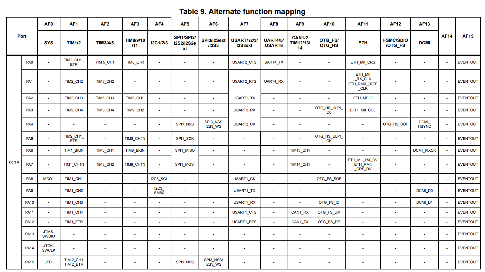
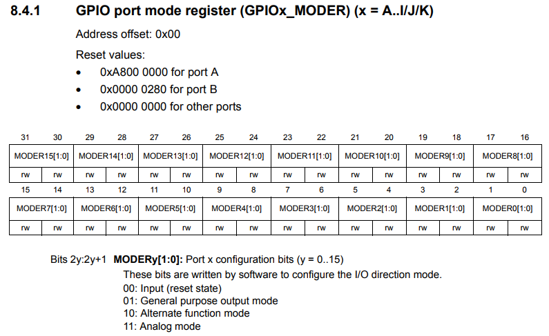
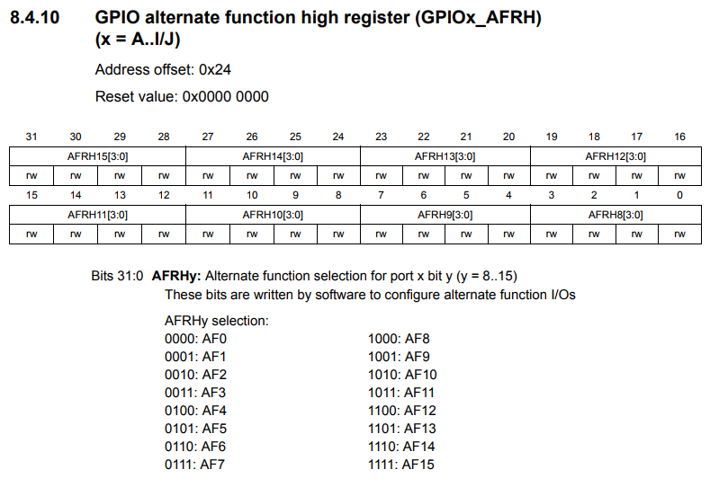
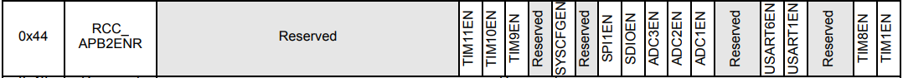
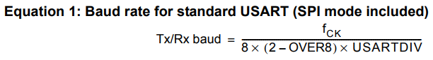
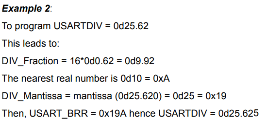
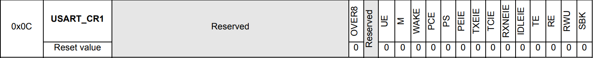
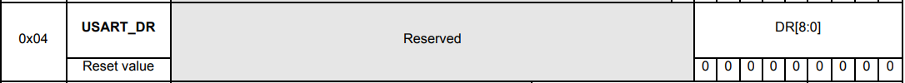
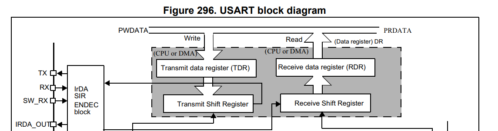
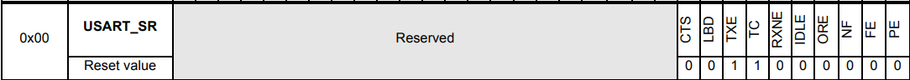

# USART

### USART instroduction
* USART는
* USART는 fractional한 baud rate gernerator를 사용해서 매우 넓은 범위의 baud rate들을 지원합니다.

* 이것은 단방향 통신 그리고 single wire인 반이중 통신을 지원합니다.
* 이것은 또한 LIN, Smartcard Protocol 그리고 IrDA SIR ENDEC 규격, 그리고 modem operations를 지원합니다.

* 빠른 속도의 data communication도 multibuffer configuration을 위해 DMA를 사용함으로서 사용이 가능합니다.

### USART main features
* 전이중, 비동기식 통신
* NRZ 표준 포맷
*
* fractional한 baud rate generator 시스템
>
* Progrmmable한 data word 길이 (8에서 9 bits)
* 설정가능한 stop bits - 1 혹은 2 stop bit를 지원
*
* 전송 동기화를 위한 전송기 clock output
* IrDA SIR encoder decoder
>
*
>
>
* Single-wire 반이중 통신
* 설정가능한 DMA를 사용한 multibuffer communication
>
* 전송기와 수신기를 위해 enable bits를 분리(?)
* 전송 감지 flags:
  1. Receive buffer full
  2. Transmit buffer empty
  3. End of transmission flags
* Parity control:
  1. Transmits parity bit
  2. 받은 데이터 parity 체크
* 4개의 에러 감지 flags:
  1. Overrun 에러
  2. Noise 에러
  3. Frame 에러
  4. Parity 에러
* 열개의 interrupt sources 및 flags:
  1. CTS 변화
  2. LIN break 감지
  3. 전송 데이터 register 빔
  4. 전송 완료
  5. 수신 데이터 register 꽉참
  6. Idle line 수신
  7. Overrun 에러
  8. Framing 에러
  9. Noise 에러
  10. Parity 에러
* Multiprocessor communication - 만약 address 일치가 발생하지 않는다면 mute mode에 들어감
* mute mode로부터 일어남 ()
* 두개의 수신 wakeup modes: Address bit(MSB, 9th bit), Idle line

### USART function description
interface는 외부적으로 다른 장치와 3가지 핀으로 연결된다. 양방향의 통신이 필요한 모든 USART는 최소한의 두 핀이 필요하다 : RX와 TX.

RX : Receive Data Input은 serial data input이다. Oversampling 기술은 들어오는 유효한 데이터와 noise를 구분하므로서 data recovery에 사용된다.

TX : 전송 Data 출력. 전송기가 disable 됐을 때, 출력 핀은 I/O 포트 configuration으로 돌아간다. 전송기가 사용 가능하지만 아무것도 전송할게 없을때, TX핀은 high level이다. Single-wire 그리고 Smartcard 모드일때, 이 I/O는 data를 송수신한다 (USART level에서, SW_RX에서 data가 수신된다).

### Fractional baud rate generation
수신기와 송신기를 위한 baud rate는 USARTDIV에 프로그래밍된 Mantissa값과 Fraction 값이 같게 설정되어야 합니다.

## Coding
USART1번을 사용해서 PC와 MCU간의 통신을 해본다.

GPIOA에 CLOCK을 공급한다.

Alternate fucntion mapping 표를 보면 PA9번과 PA10번에 각각 USART_TX와 USART_RX가 연결된 것을 볼수 있다. Alternate fucntion을 사용하기 위해 **GPIOA_MODER** 레지스터에 설정을 해줘야 한다.

PA9와 PA10을 사용 할것 이므로 [19 : 18]과 [17 : 16] 비트에 Alternate fucntion mode의 값인 **0b10** 을 써넣으면 된다.

Alternate function mode로 설정한 후에 몇번 Alternate function을 쓸지 결정하기 위해 **GPIOA_AFRH** 레지스터에 세팅을 해준다. **Alternate fucntion mapping** 표에서 확인할 수 있듯이 **AF7** 번을 사용할 것이므로 **0b0111** 을 세팅해주면 된다.

 
 USART1을 사용하기 위해서 clock을 enable 해줄 필요가 있다. USART1번은 APB2 버스에 물려있으므로, **RCC_APB2ENR** 레지스터에서 USART1번을 enable 시켜주자.

원하는 buad rate를 사용하기 위해 **USART_BRR** 레지스터에 계산해서 세팅해줄 필요가 있다. 식은 위와 같다. **Tx/Rx baud** 는 우리가 원하는 baud rate를 적으면 된다. 여기서는 **9600** 을 기준으로 한다. **fck** 는 사용하고자 하는 USART에 연결된 버스의 클럭이다. 현재는 APB2버스에 연결되있고 **84Mhz** 을 사용하고 있다. **OVER8** 은 Oversampling사용 유무인데 사용하지 않으므로 **0** 으로 둔다. 계산을 해보면 USARTDIV는 **546.875** 라는 값이 나온다.

구한 **USARTDIV** 값으로 **USART_BRR** 레지스터에 채울 값을 구하는 부분이다. **DIV_Fraction** 값을 구하기 위해 소수부인 0.875와 16을 곱해준다. 그러면 **14** 값이 나온다. **DIV_Mantissa** 값을 구하기 위해 정수만 따로 땐다. **546** 값이 나온다. 이 둘을 16진수로 변환해서 앞에는 **DIV_Mantissa** 뒤에는 **DIV_Fraction** 값을 배치시킨다. 최종적인 **USART_BRR** 레지스터에 설정해야하는 값은 **0x222E** 가 된다.

USART를 사용하기 위해 **USART_CR1** 레지스터의 **UE, TE, RE** 각각 **USART enable**, **Transmitter enable**, **Receiver enable** 비트를 Set 해준다.

위 레지스터가 실제로 USART로 데이터를 주고받기 위한 데이터를 넣고 빼는 레지스터다. Code상에는 **USART_DR** 레지스터 하나만 사용하지만

실제는 위와같이 **Transmit data register(TDR)** 과 **Receive data register (RDR)** 이 따로있다. 값을 쓸때는 **TDR** 읽을 때는 **RDR** 을 접근하게 된다.

USART로 DATA를 주고받을 때 **USART_SR** 레지스터를 활용하여 적절하게 분기 조절을 하면된다.
