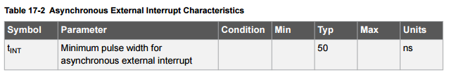

## 동기 인터럽트와 비동기 인터럽트

이 markdown파일의 설명은 **atmega128a**를 기준으로 설명을 한다

Datasheet
- http://www.atmel.com/Images/Atmel-8151-8-bit-AVR-ATmega128A_Datasheet.pdf

### 비동기 인터럽트
atmega128a의 **INT0 ~ 3** 핀들은 비동기(asynchronous) 인터럽트로 동작한다.
핀 **INT0 ~ 3** 에 들어오는 pulse들은 아래 나온 테이블(17-2)에 적혀있는 **Minimum Pulse 보다 넓어야 인터럽트를 gernerate** 해준다.

그보다 짧은 pulse들은 인터럽트 generate가 보장되지 않는다.

### 동기 인터럽트
atmega128a의 **INT 4 ~ 7** 핀들은 동기 인터럽트로 동작한다.

INT 4 ~ 7 핀들은 edge를 detecting하기 전에 sample당합니다. 직역으로 느낌이 이상하지만 관촬된다 정도로 해석하면 될거 같네요.

pulse가 한 clock의 기간(period)보다 길면 인터럽트를 generate해줍니다.

그보다 짧은 pulse들은 역시 인터럽트 generate가 보장되지 않습니다.
