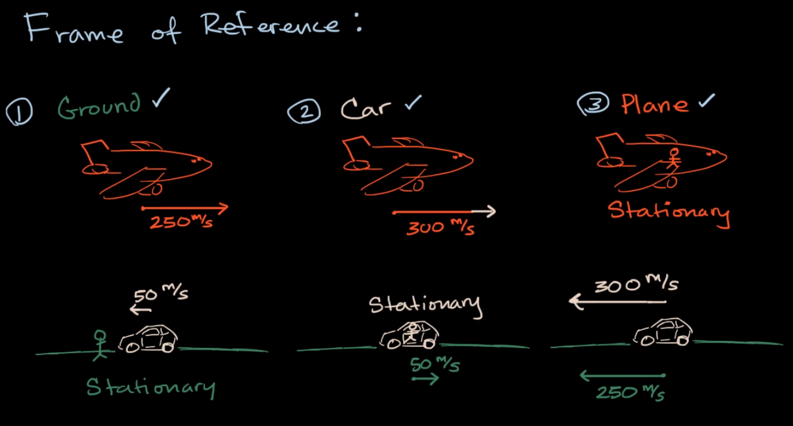

# Frame of Reference(기준틀)

위치나 속도를 측정할 때 관점에 따라서 달라질 수 있다.

1. 내가 땅 위에 있다고 하자. 나는 내가 있는 땅이 정지된 상태로 인식한다. 그 때 차를 바라봤을 때 그리고 비행기를 바라봤을 때, 각각 50m/s, 250m/s 로 보인다고 가정하자.

2. 이번에는 내가 차 안에 있다고 하자. 나는 내가 있는 차량 안을 정지된 상태로 인식한다. 그 때 밖의 땅을 바라봤을 때 50m/s로 움직인다고 인식한다. 그리고 비행기를 바라볼 때 다른 방향으로 달리고 있으므로 250 + 50m/s 로 움직인다고 보인다.

3. 이번에는 내가 비행기 안에 있다고 하자. 나는 내가 있는 비행기 안을 정지된 상태로 인식한다. 그때 밖의 땅과 자동차를 바라봤을 때, 땅은 250m/s로 움직이는 것처럼 보이고, 자동차는 300m/s로 움직는 것으로 보인다.

보통 우리는 생각할 때 2번과 3번은 잘못 측정한것이라고 생각할 수도 있다. 하지만 물리학적 관점으로 봤을 때 3개 모두 다 유효한(정당한) **Frame of Reference** 들이다.

### Source
https://www.youtube.com/watch?time_continue=408&v=3yaZ7lkQPUQ
